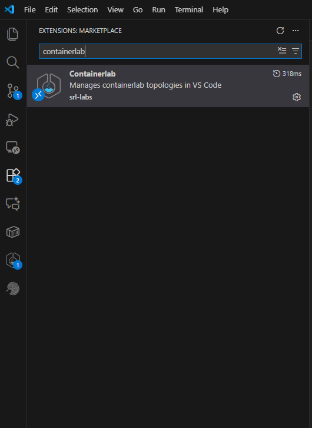
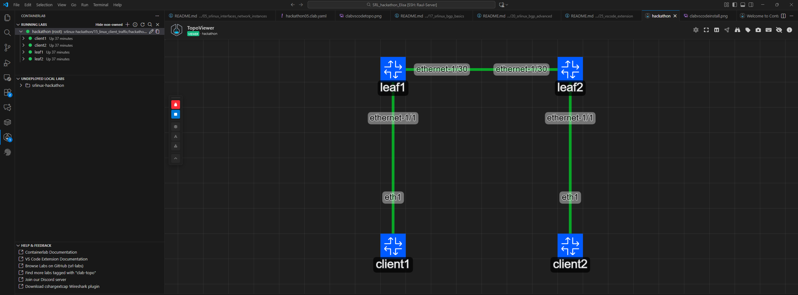
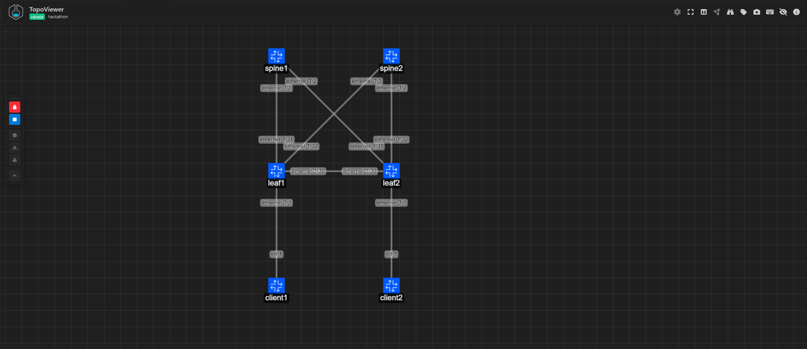

# Task 25: Using the VS Code Extension to expand our network
Containerlab was primarily a CLI tool, until recently. Last year, the first prototype of the VS Code extension dropped around this time of the year, and since then, it developed into a fully-featured GUI of Containerlab. It would be a crime to miss out on trying out this extension!
    
If you haven't done so yet, this is the time to install it!
The Containerlab VS Code extension can be installed from the official VS Code marketplace.


    
Key feature of the containerlab VS Code extension are:
- Manage the lab lifecycle (deploy, destroy, redeploy, inspect)
- Show and visualize running labs, and undeployed labs in the current project directory
- Create and edit topologies with a visual topology editor
- Capture link traffic and manage link impairments

Let's give it a spin! The Containerlab extension should be able to discover your running lab topology already. Next to your lab is a status indicator - red means a container is unhealthy in the topology, yellow means deployment in progress, and green is for successfully deployed lab topologies.  

- Clicking on a lab topology's name opens the topology viewer on the lab.
- Clicking on the arrow next to the lab topology's name reveals the nodes running in the topology. By right clicking these nodes, you can do various actions, like connecting to the node via SSH in the built-in VS Code terminal, or running a command inside them.  
- Next to the node name are three buttons - view logs, open a shell inside the container (via Docker exec), and connect via SSH.
- Clicking on a node inside a topology shows the node interfaces, on which you can perform packet captures and set link impairments.

Pretty cool, eh?  
Below the running labs section is the undeployed labs one.  
    


The Containerlab VS Code extension also allows you to edit the topology, let's take advantage of that!

> [!IMPORTANT]
> Before you can edit the topology in the TopoViewer you have to destroy the lab, so make sure you save your progress.

## Task 25.2: Hardware types in Containerlab

Certain types of Kinds can be customized further in Containerlab using the `type` node property. This property allows you to define a hardware variant for both SR Linux and SR OS (SR-SIM) nodes, along with other different Kinds, allowing the simulation of not only generic network nodes, but of specific hardware nodes (with the appropriate feature set and front port layout).

So far, in our topology, the `type` node property was not used -- so what kind of nodes were we running? The [SR Linux Kind's documentation page](https://containerlab.dev/manual/kinds/srl/#types) has this documented!

**As the next task, let's change the node `type` of both leaf switches to the IXR-D3L, and after a redeploy (the lab directory must also be cleaned up), verify that the hardware we are running is really an IXR-D3L, with the correct front port mix of 32x 100GbE ports!**

<details>
<summary>Task 25.2 solution</summary>

Changing the topology:
```yaml
name: hackathon

topology:
  nodes:
    leaf1:
#     ...
      type: ixr-d3l
    leaf2:
#     ...
      type: ixr-d3l
# ...
```
This can also be done in the VS Code extension by clicking on the node and adjusting the type.

Verifying the version and ports:

```
A:admin@leaf1# show version
...
Chassis Type         : 7220 IXR-D3L
...
A:admin@leaf1# show interface brief
ethernet-1/1        | enable                                                | up                                                    | 100G
ethernet-1/2        | disable                                                | up                                                    | 100G
```

</details>

## Task 25.3: Adding a spine to the topology in Containerlab

Let's make use of this new knowledge and add two spine switches to the topology!

They should be called `spine1` and `spine2` (very creative!), and should be the hardware variant IXR-H4-32D.

The leafs also need to be connected to the spine switches, via `ethernet-1/31` (to `spine1`) and `ethernet-1/32` (to `spine2`). On the spine side, `leaf1` should be connected via the `ethernet-1/1` interface, while `leaf2` should be connected via `ethernet-1/2`.

The topology diagram has expanded for your convenience:

```
        ┌─────────┐                 ┌─────────┐        
        │         │                 │         │        
        │  spine1 │                 │  spine2 │        
        │         │                 │         │        
        └─────────┘                 └─────────┘        
             │     \\             //     │             
             │       \\         //       │             
             │         \\\   ///         │             
             │            \//            │             
             │           // \\           │             
             │        ///     \\\        │             
             │      //           \\      │             
             │   ///               \\\   │             
             │ //ethernet-1/32        \\ │ethernet-1/32
ethernet-1/31//            ethernet-1/31\│             
        ┌─────────┐                 ┌─────────┐        
        │         │ethernet-1/30    │         │        
        │  leaf1  │─────────────────│  leaf2  │        
        │         │    ethernet-1/30│         │        
        └─────────┘                 └─────────┘        
             │ethernet-1/1               │ethernet-1/1 
             │                           │             
             │                           │             
             │                           │             
             │                           │             
             │                           │             
             │eth1                       │eth1         
        ┌─────────┐                 ┌─────────┐        
        │         │                 │         │        
        │ client1 │                 │ client2 │        
        │         │                 │         │        
        └─────────┘                 └─────────┘        
     network-multitool           network-multitool     
```

<details>
<summary>Task 25.3 solution</summary>

```yaml
name: hackathon

topology:
  nodes:
#   ...
    spine1:
      kind: nokia_srlinux
      image: ghcr.io/nokia/srlinux:25.10.1
      startup-config: config/spine1.cli
      type: ixr-h4-32d
    spine2:
      kind: nokia_srlinux
      image: ghcr.io/nokia/srlinux:25.10.1
      startup-config: config/spine2.cli
      type: ixr-h4-32d
#   ...

  links:
#   ...
    - endpoints: [ "leaf1:ethernet-1/31", "spine1:ethernet-1/1" ]
    - endpoints: [ "leaf1:ethernet-1/32", "spine2:ethernet-1/1" ]
    - endpoints: [ "leaf2:ethernet-1/31", "spine1:ethernet-1/2" ]
    - endpoints: [ "leaf2:ethernet-1/32", "spine2:ethernet-1/2" ]
```

or like the following in the VS Code Containerlab TopoEditor:



</details>

> [!NOTE]
> For the 2 new spines, use the following specs: image:25.10.1, type: ixr-h4-32d

> [!WARNING]
> The containerlab extension - TopoViewer tool will introduce extra two nodes (`srl1`, `srl2`) if you change the default name which is added by the tool to a different name. This is a bug which will be fixed in the next release.
> To avoid this, just close the TopoViewer before deploying. Open the `edit topology` without having the TopoView opened in a different tab and remove those extra 2 nodes.
> Keep in mind that if the TopoView is unlocked, and open in a tab, it will overwrite the .clab.yaml file!

