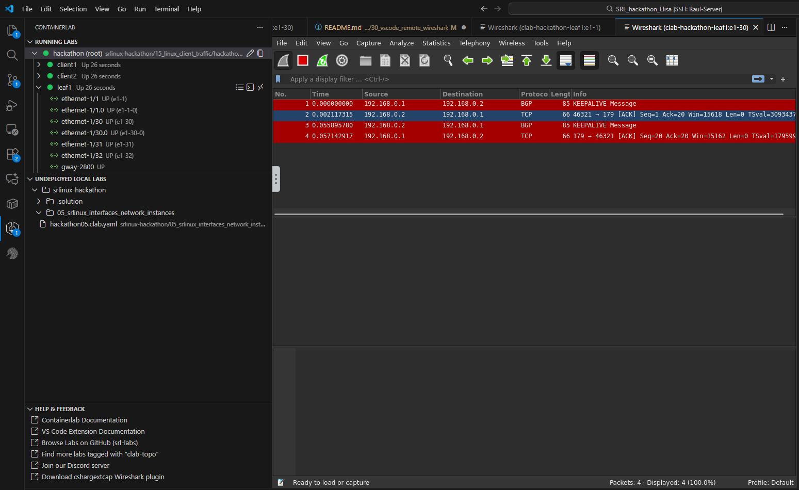

# Task 30: Traffic monitoring & manipulation 
## Traffic monitoring

You might have noticed the shark fin logo either in the Topology Viewer, or in the list of interfaces in your running lab. **Click it!**  
VS Code will ask to install edgeshark if it's not installed, just accept to install.

    

Now you are capturing traffic from a lab topology running a few hundred-thousand kilometers away.  
Way cool. 😎
    
This packet capture is powered by Edgeshark and a containerized, VNC-enabled Wireshark instance that starts and stops on-demand, for your packet capture needs.
    
    
## Traffic manipulation
    
We won't stop at traffic monitoring though, we can also test different link impairments' effects on the network topology, such as:
- Delay
- Jitter
- Loss
- Rate-limiting
- Packet corruption

The easiest way to manage these link impairments is the VS Code extension (right click on the interface).

More information on configuring link impairments in containerlab topologies can be found [here.](https://containerlab.dev/cmd/tools/netem/set/)
    
This is the time to break things, so go ahead and play with these settings!