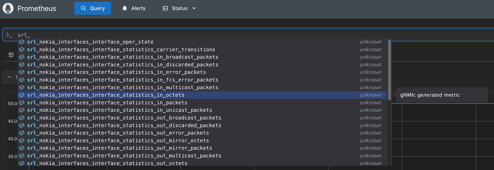
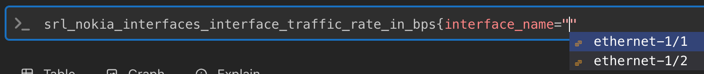
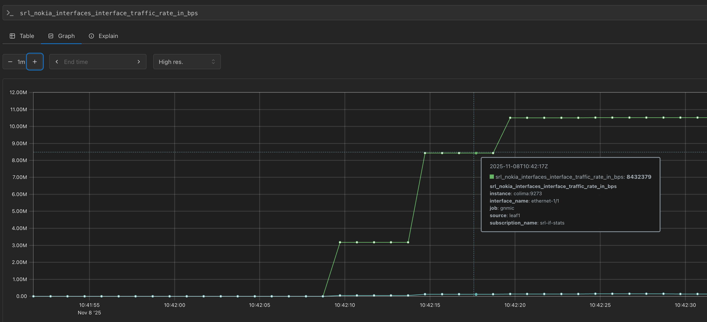

# Section 55: Streaming Telemetry, Prometheus

Just to recap, we are still building our streaming telemetry solution. We're going to be using the following building blocks to do so:
- ✅ **gNMIc**  
is an open-source gNMI client, which allows you to collect information via streaming telemetry from a gRPC-enabled network node. For example, in this topology, SR Linux works with gNMI out of the box, and requires no additional configuration.
- **Prometheus**  
is a very popular time-series database (TSDB). We will use it to query and store the data collected by gNMIc.
- **Grafana**  
is the one of the most popular tools for data visualization. It is used across various industries, and allows us to visualize the data that is stored in various data sources, like Prometheus.  

## Task 55.1: Installing Prometheus

Instead of installing Prometheus directly on the host, **let's put it into our Containerlab topology straight away, and configure it to retrieve metrics from the gNMIc scrape endpoint we just created in the previous step!** The [Getting Started guide](https://prometheus.io/docs/prometheus/latest/getting_started/) and the [install documentation](https://prometheus.io/docs/prometheus/latest/installation/#using-docker) of Prometheus are nice starting points for this. 

When using containerized services, remember that services can reach each other easily via DNS names of the containers in the same container network. Since we are communicating over the management network, you don't need to manually link the gNMIc and Prometheus containers.

<details>
<summary>Task 55.1 solution</summary>

Containerlab topology changes:
```
name: hackathon
topology:
# ...
  nodes:
    prometheus:
      kind: linux
      image: prom/prometheus:v3.8.0
      binds:
        - config/prometheus.yml:/etc/prometheus/prometheus.yml
#   ...
```

prometheus.yml:
```
global:
  scrape_interval: 15s

scrape_configs:
  - job_name: 'prometheus'
    scrape_interval: 5s

    static_configs:
      - targets: ['gnmic:9273']
```
</details>

Prometheus should be up and running! Use `containerlab inspect` and `docker logs` to confirm the status of the new Prometheus container. Try to connect to the web UI of Prometheus running on port 9090!

> [!TIP] Having issues connecting to port 9090 from your browser?
>
> Container images contain metadata about what ports they expose (meaning ports that will be accessible from the host as well, not just when directly connecting to the container). By default, Prometheus does not expose its port 9090, this must be set up manually! Refer to Containerlab's [documentation on the `ports` node parameter](https://containerlab.dev/manual/nodes/#ports).

## Task 55.2: PromQL



You can use the query builder to create various types of queries in Prometheus' query language, PromQL, such as filtering on interface name based on the labels of the metrics.
    


**Try to query for the operational state of interfaces on leaf1!**

<details>
<summary>Task 55.2 solution</summary>

```
srl_nokia_interfaces_interface_oper_state{source="leaf1"}
```

</details>

You can also view a graph of the values, sort of like Grafana, but not with not as many bells and whistles! This shows that Prometheus stores the data, unlike gNMIc.

