# Section 60: Streaming Telemetry, Grafana

Just to recap, we are still building our streaming telemetry solution. We're going to be using the following building blocks to do so:
- ✅ **gNMIc**  
is an open-source gNMI client, which allows you to collect information via streaming telemetry from a gRPC-enabled network node. For example, in this topology, SR Linux works with gNMI out of the box, and requires no additional configuration.
- ✅ **Prometheus**  
is a very popular time-series database (TSDB). We will use it to query and store the data collected by gNMIc.
- **Grafana**  
is the one of the most popular tools for data visualization. It is used across various industries, and allows us to visualize the data that is stored in various data sources, like Prometheus.  

## Task 60.1: Installing Grafana

Grafana is a bit more complex than Prometheus, yet, we can easily insert this last piece of the puzzle into our topology -- the wonders of containerization!

**So, put Grafana into our Containerlab topology!**

`grafana/grafana:11.2.0` is the image we are going to use. For now, no bind mounts, and we will just have to expose port 3000 of the container.
Since we only need management connectivity for Grafana, no additional links are required in the topology.

<details>
<summary>Task 60.1 solution</summary>

```
name: hackathon

topology:
  nodes:
# ...
    grafana:
      kind: linux
      image: grafana/grafana:11.2.0
      ports:
        - 3000:3000
# ...
```

</details>

Once you redeploy the topology, you should be able to see Grafana running on port 3000 of your workshop VM!

## Task 60.2: Setting up data sources in Grafana

Our Grafana deployment is brand new, and has the default credentials admin/admin. Let's change that to "admin!" on the first login.
    
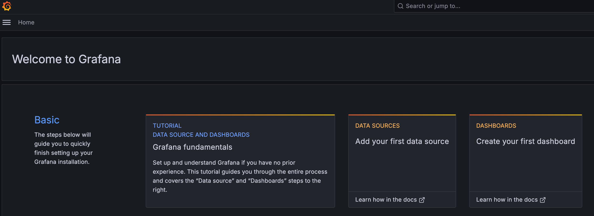

As the quick start steps suggest, we should add our first data source! Click through the interactive wizard to add the Prometheus data source. Because Docker sets up the DNS entries within the Docker network automagically, we don't have to think much on how to set this up. :)

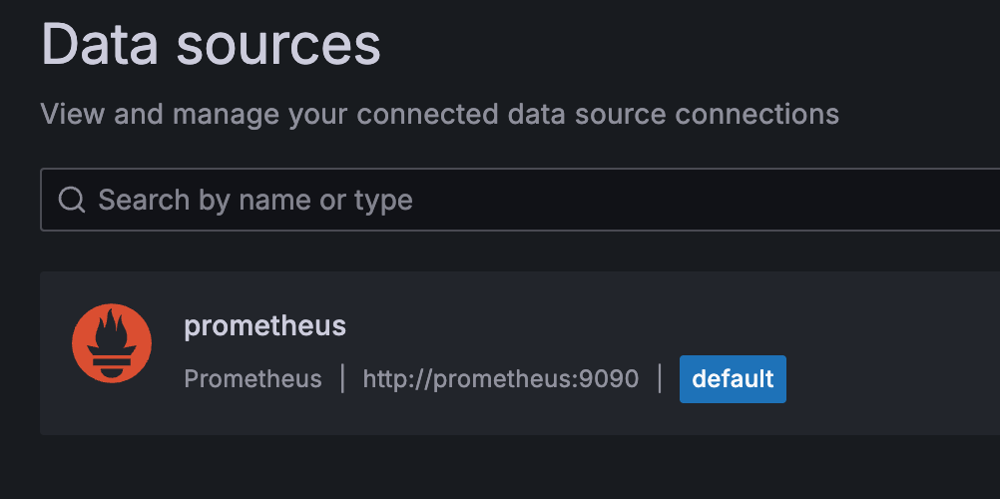

## Task 60.3: Setting up data sources in Grafana
    
Now that we have access to the time series data from Prometheus, let's create our first dashboard. To do so, go back to the Grafana homepage and click the button to create a dashboard.

The first graph we are going to create is a classic graph of interface speed. Our data source is going to be Prometheus, of course. In the query panel, a blank query called "A" is already pre-populated. Let's rename this to "in-bps".
    
The metric field is where you can interactively select the metric from Prometheus to display. Let's pick `srl_nokia_interfaces_interface_traffic_rate_in_bps` here!
    


By default, Prometheus serves us integers for this time series data, but we know that this is bits/second, so make sure to also tell Grafana that in the right side pane.
    
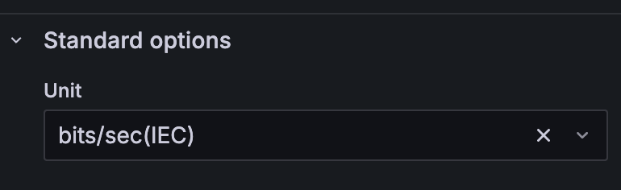

Click Apply to save your changes to your very first visualization in this topology!
    
The next one is going to be somewhat trickier, we're going to visualize the state of the ports across time. How, you might ask? We're going to use a different kind of visualization.
    
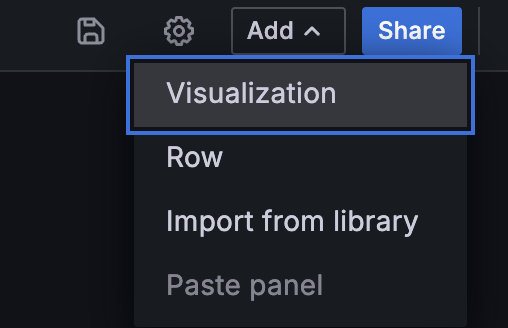
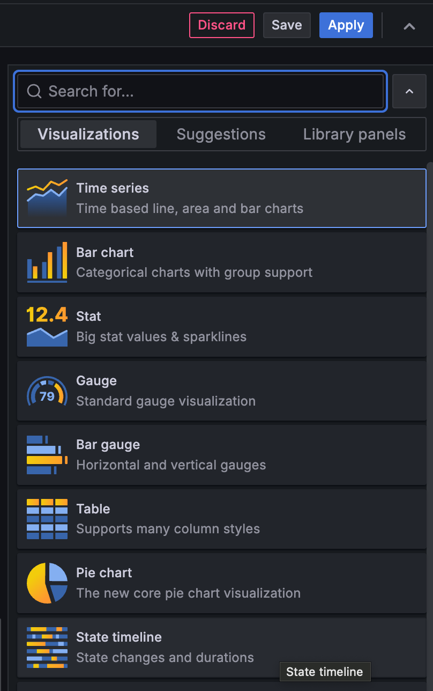

When you first select the metric for the interface operational state, it will look all kinds of messed up...
So, let's fix that!

We have too much data! Let's filter down to only leaf1's interface operational states in the label filter option.

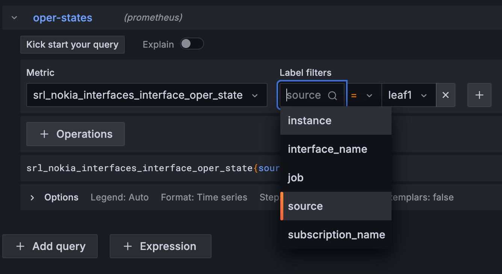
    
The legend shown on the visualization is very verbose. Instead, we are going to use a Custom legend, and make it display the value of the `interface_name` label.
    
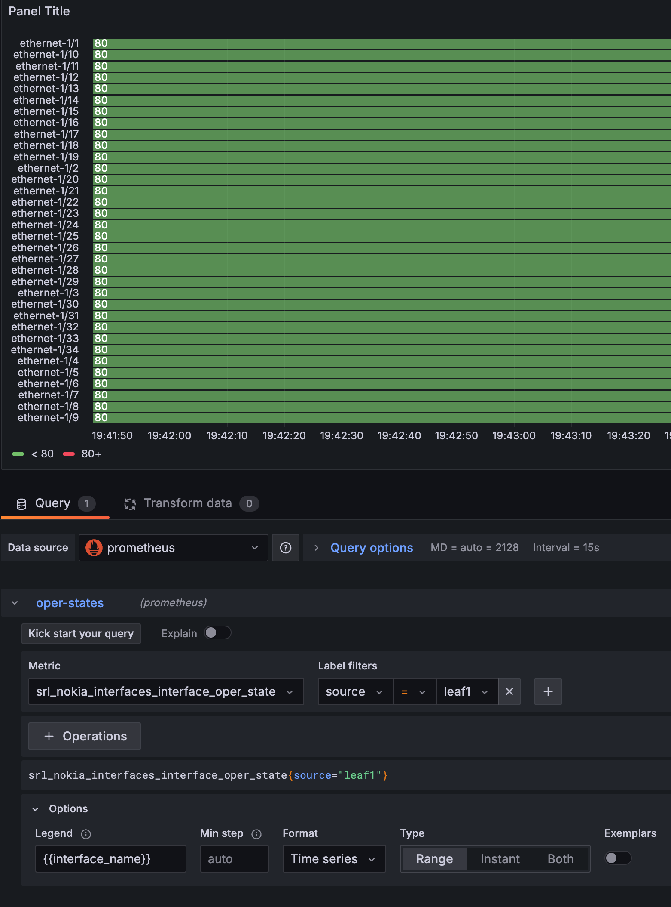

Second, it's all green! This is because by default on this visualization, any value under 80 is shown as green, and over 80 are red, as the panel legend suggests. We can fix this on the right pane.
Delete the 80 threshold, set a value mapping of 0 to red, 1 to green, and set the color scheme to a single color.

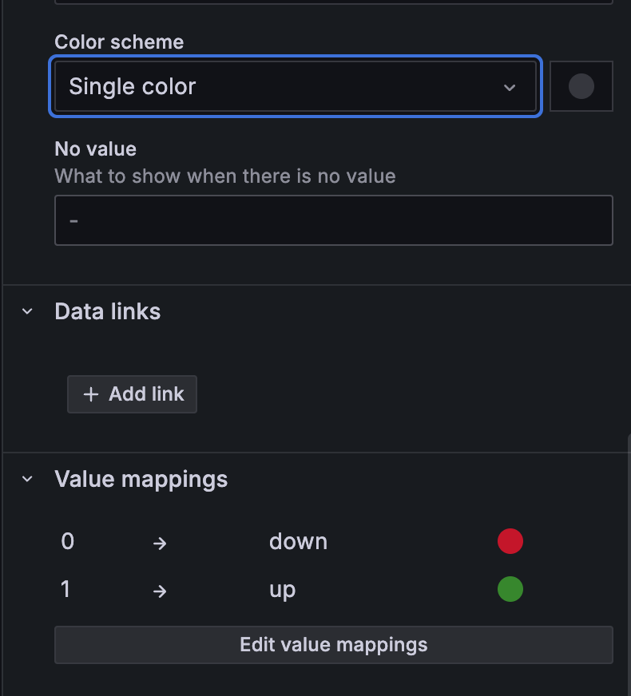
    
You should have a working visualization!

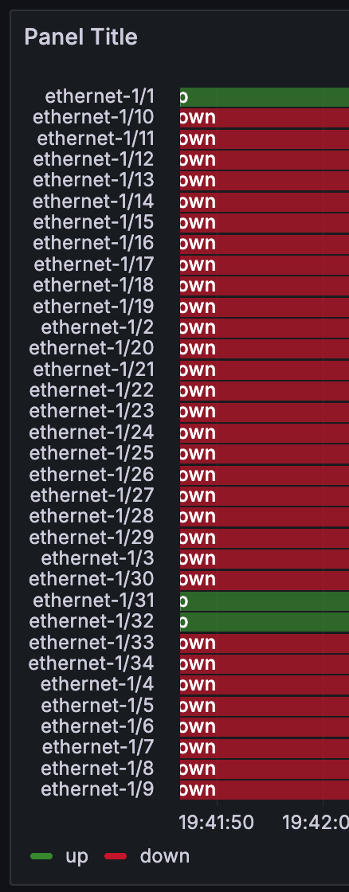

This is how our dashboard looks so far.

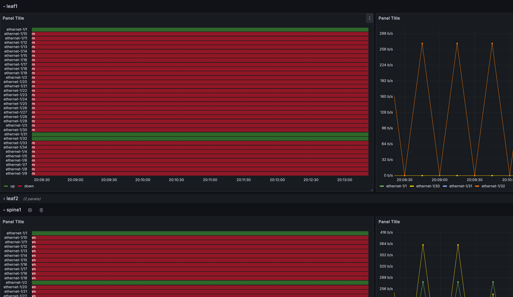

However, the first visualization is still showing us all the in-bps values across all switches. We should instead let Grafana generate a pair of dashboards for each switch we have! We're going to use the [repeated rows](https://grafana.com/blog/2020/06/09/learn-grafana-how-to-automatically-repeat-rows-and-panels-in-dynamic-dashboards/) feature of Grafana for this.

On the top right, click Add, and select row. Name the row `$switch`. Click the gear icon next to add, and in the Variables tab, click Add variable, select Custom variable type, call it `$switch`, and in the values section, enter the names of your switches separated by commas, like so:

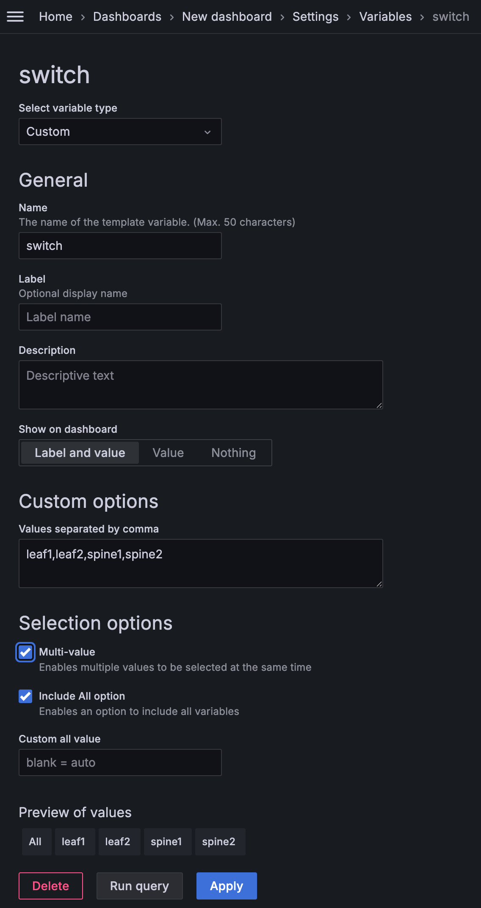

Make sure the "multi-value" and "include all option" are selected!

Going back to our dashboard, you will notice that suddenly, our row is called "leaf1" and there is now a variable selector on the top left of the dashboard.

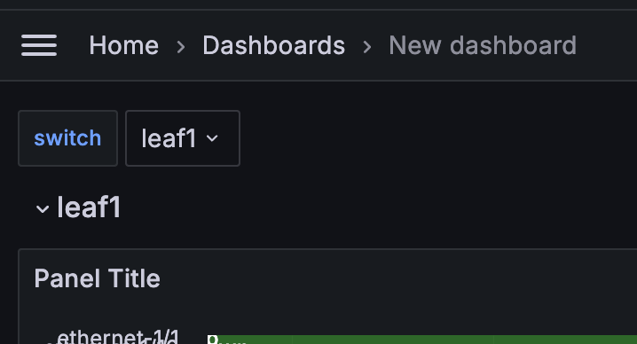

Let's use this new variable in our existing visualization panels! In the interface operational state panel, simple replace the static "leaf1" in the label filter section with `$switch`. In the in-bps panel, you will have to add a label filter for the source. While you are there, also replace the legend to be the interface name, like you have done before.

After applying you changes, go back to the main dashboard, and look at the result of your hard work, and select a different switch, for testing's sake!

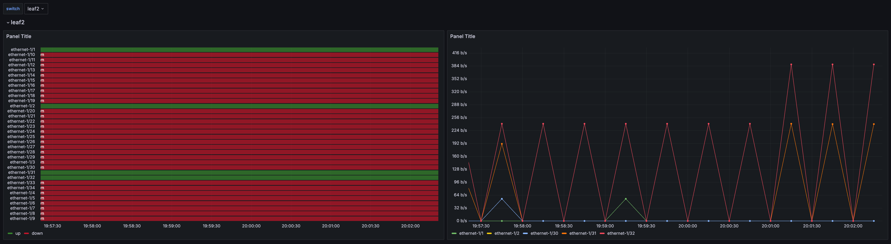

We're not done yet, though! If you hover over the name of the panel, and click on the cogwheel, you can set the row to be repeated for all switch values:

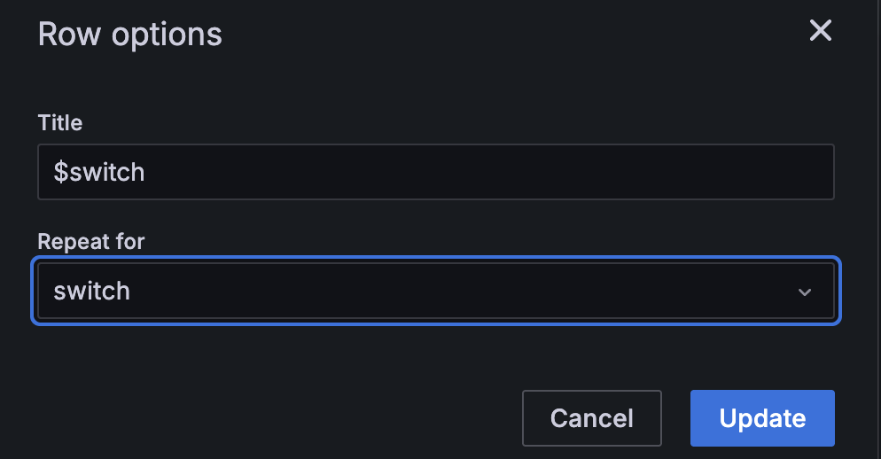

We're done with our multi-switch dashboard!


**Don't forget to save your work!**
You can do so with the little save icon up top. By clicking on the settings icon and selecting the JSON Model tab, you can even find a JSON-serialized version of the dashboard.

To give you an idea of how complex you can get with Grafana, here you can find a complete Grafana telemetry lab in the [SR Linux Telemetry Lab](https://github.com/srl-labs/srl-telemetry-lab/).
